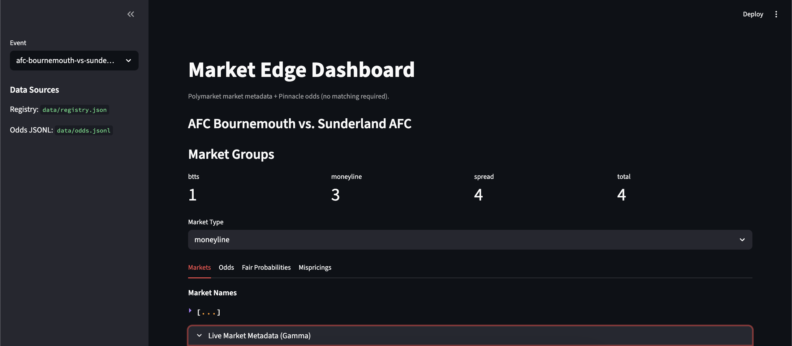
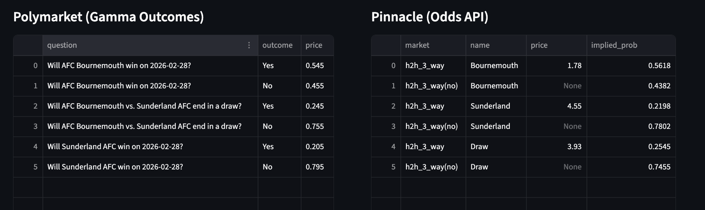
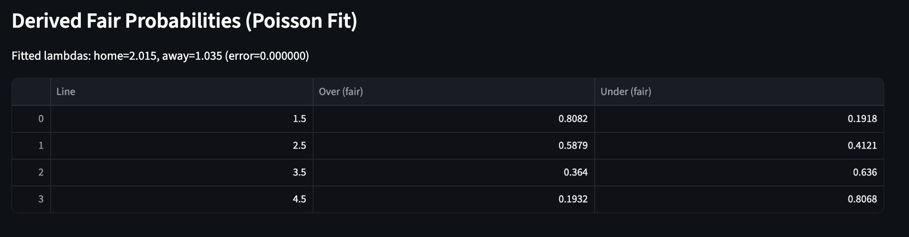
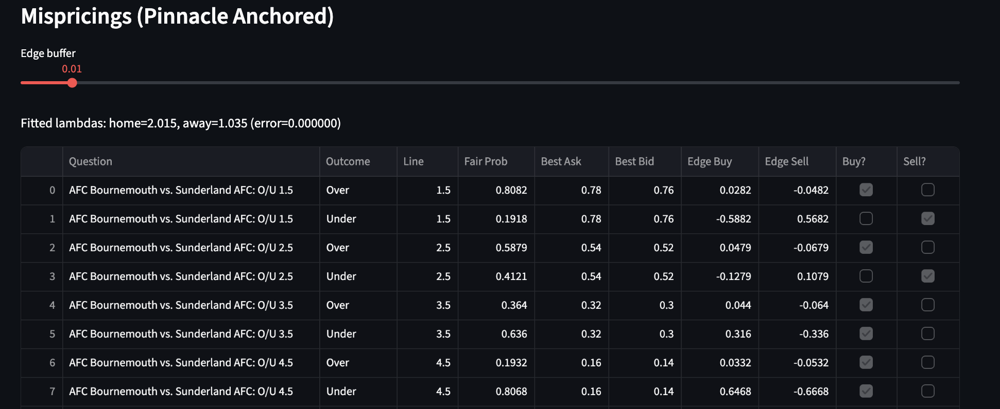

# Market Edge (Polymarket Soccer Watcher)

A read-only CLI + library for discovering soccer markets on Polymarket, subscribing to live CLOB updates, maintaining local order books, and logging normalized events + derived snapshots for downstream modeling.

## Dashboard (Streamlit)

Run:

```bash
streamlit run app/dashboard.py
```

Screenshots:
-  
-  
-  
-  


## Statistical Modeling Overview

This repo includes a simple, deterministic Poisson pricing engine anchored to Pinnacle Asian lines. The goal is to use a compact set of liquid anchor markets to infer a fair distribution of match outcomes, then derive fair probabilities for other lines and compare against Polymarket pricing.

### 1) Anchor Inputs (Pinnacle)

The model uses two independent two-way markets as anchors:

- Asian Total **2.75** (Over/Under)
- Asian Handicap **-0.75** (Home/Away)

Odds are provided in decimal (European) format.

### 2) Remove Vig

Convert odds to implied probabilities:

```
p_raw = 1 / odds
```

Then normalize each two-way market:

```
pA = pA_raw / (pA_raw + pB_raw)
pB = pB_raw / (pA_raw + pB_raw)
```

### 3) Poisson Model

Assume independent team scoring:

```
HomeGoals ~ Poisson(lambda_home)
AwayGoals ~ Poisson(lambda_away)
```

### 4) Anchor Likelihood Targets

For total line **2.75** with total goals `T`:

```
P(Over 2.75) = 0.5 * P(T >= 3) + 0.5 * P(T >= 4)
```

For handicap line **-0.75** with goal diff `D = HomeGoals - AwayGoals`:

```
P(Home -0.75) = 0.5 * P(D >= 1) + 0.5 * P(D >= 2)
```

### 5) Fit (lambda_home, lambda_away)

We use a deterministic grid search (no SciPy):

- Sweep `lambda_total` over a reasonable range.
- For each total, sweep `lambda_home` in `(0, lambda_total)`.
- Minimize squared error to the two anchor probabilities.
- Perform a local refinement around the best point.

### 6) Derived Fair Probabilities

From fitted lambdas, we compute:

- Moneyline (Home / Draw / Away)
- Totals: 1.5, 2.5, 3.5, 4.5 (and any half-goal line)
- Spreads: any half-goal line
- BTTS (Yes / No)

### 7) Mispricing Engine

For Polymarket outcomes, we compute edges:

```
edge_yes_buy  = p_fair - best_ask
edge_yes_sell = best_bid - p_fair
```

An actionable flag is raised when the edge exceeds a configurable buffer (default 0.03).

## Setup

```bash
python -m venv .venv
source .venv/bin/activate
pip install -e .
```

## Usage

### Ingest (Live)

```bash
python -m market_edge.ingest \
  --query "Team A vs Team B" \
  --log-events data/events.jsonl \
  --snapshot-every 5 \
  --levels 5
```

Optional snapshot storage:

```bash
python -m market_edge.ingest \
  --query "Team A vs Team B" \
  --log-events data/events.jsonl \
  --snapshot-every 5 \
  --snapshot-jsonl data/snapshots.jsonl \
  --snapshot-sqlite data/snapshots.db
```

### Replay (Offline)

```bash
python -m market_edge.replay --path data/events.jsonl --levels 5 --speed 1.0
```

## Odds API (Pinnacle)

Fetch Pinnacle odds via The Odds API and write `data/odds.jsonl`:

```bash
export ODDS_API_KEY=YOUR_KEY
python -m market_edge.odds_api \
  --sport soccer_epl \
  --event-id <ODDS_API_EVENT_ID> \
  --registry-event-id <POLYMARKET_EVENT_ID> \
  --regions eu \
  --markets h2h_3_way,spreads,totals,btts \
  --bookmakers pinnacle \
  --out data/odds.jsonl
```

## Registry

- The registry is stored at `data/registry.json`.
- It maps a stable `event_id` to market IDs and token IDs.
- The `event_id` is generated by slugifying the match name plus date (when available).

## Assumptions (Documented Decisions)

- `--query` uses Gamma `public-search` and falls back to `events` if empty.
- If multiple matches are returned, the tool chooses the event with the most token IDs.
- Market type inference is heuristic (e.g., `1x2`, `btts`, `o2.5`).
- CLOB `price_change` updates are mapped to order book deltas.
- `best_bid_ask` messages are logged but not applied to the full book.
- Snapshots default to JSONL when `--snapshot-every` is set and no snapshot path is provided.

## Tests

```bash
pytest
```
